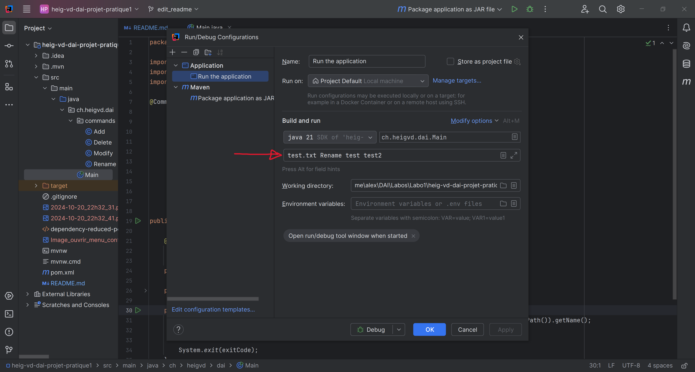

# heig-vd-dai-projet-pratique1
#### Delétraz Alexandre - Chollet Florian

## Introduction
Le projet que nous avons choisi de faire permet d'ouvrir un fichier et d'opérer sur les variables qu'il contient.  
Les différentes opérations que l'application peut faire sont :
- Add, qui permet d'ajouter une variable.
- Delete qui permet de supprimer entièrement une variable.
- Modify qui permet de modifier la valeur de la variable.
- Rename qui permet de renommer une variable.

## Implémentation
Chacune des commandes ont été créés dans un fichier séparé dans le dossier commands.
Les commandes font attentions aux points suivants :
- La commande Add vérifie que la variable que nous souhaitons ajouter n'existe pas déjà. Auquel cas un message
  avertissant l'utilisateur s'affiche et le fichier n'est pas modifié.
- La commande Rename vérifie que le nouveau de la variable ne soit pas déjà prit par une autre variable dans le fichier.
  Auquel cas le fichier n'est pas modifié.
- La commande Delete vérifie que le nom de la variable existe dans le fichier. Si la variable n'existe pas, un message
  s'affiche indiquant le problème et le fichier n'est pas modifié.
- La commande Modify permet de modifier la valeur d'une variable.  

## Git Clone et build local de l'application (git et Maven)

Afin d'utiliser notre application sur votre machine en local, vous pouvez vous rendre sur notre repo GitHub en cliquant 
sur le lien suivant : [repoProjet](https://github.com/luma2010/heig-vd-dai-projet-pratique1)  
Une fois sur notre repo, nous vous recommandons de faire un fork du projet, cela vous permettra de tester ce que nous 
avons fait et d'y apporter des modifications de votre côté comme bon vous semble. Pour cela, il vous suffit de cliquer 
sur le bouton comme montrer dans l'image ci-dessous :  

 

Ouvrez le projet avec InteliJ. Vous devriez voir dans la partie supérieure droite, à côté du bouton play, le bouton
d'un menu déroulant, comme montré ci-dessous :  


La première chose à faire est de choisir la configuration "Package application JAR file" :


Une fois sélectionnée, lancer cette configuration en cliquant sur le bouton play en vert.


Une fois que vous avez lancé cette configuration, vous pouvez vous référer à la partie des exemples d'utilisation pour
lancer le programme en ligne de commande.  
Vous pouvez aussi lancer le programme via l'IDE, en configurant la deuxième configuration (Run the application).  
Afin de la configurer, veuillez appuyer sur le menu déroulant pour les configurations comme précédemment :


Puis une fois dans le menu d'édition des configurations, vous pouvez éditer la ligne mise en évidence sur l'image
ci-dessous afin d'exécuter la commande souhaitée à chaque fois que vous appuyer sur le bouton play. Pour mieux connaître 
les commandes, veuillez vous référer au chapitre suivant sur les exemples d'utilisation.




## Exemples d'utilisation
### Add
La commande Add doit être utilisée comme ci-dessous :

```text
$ java -jar heig-vd-dai-projet-pratique-1.0-SNAPSHOT.jar <nomFichier> Add <nomVariable> <valeur>
```

Par exemple :
```text
$ java -jar heig-vd-dai-projet-pratique-1.0-SNAPSHOT.jar test.txt Add test 123
```
En cas de réussite le résultat doit être :

```text
Write new variable test with value 123
```

Si la variable existe déjà, le message doit être le suivant :

```text
Warning, variable test Already exist
```

### Delete
La commande Delete doit être utilisée comme suit :

```text
java -jar heig-vd-dai-projet-pratique1-1.0-SNAPSHOT.jar <nomFichier> Delete <nomVariable>
```

Exemple :
```text
java -jar heig-vd-dai-projet-pratique1-1.0-SNAPSHOT.jar test.txt Delete test
```
Si la variable a été supprimée, le message suivant devrait s'afficher :
```text
Variable test has been deleted.
```

La fonction affiche le message suivant si la variable n'existe pas :
```text
Variable test not found, nothing changed.
```

### Rename

L'utilisation de la commande Rename doit se faire comme l'exemple ci-dessous :

```text
java -jar heig-vd-dai-projet-pratique1-1.0-SNAPSHOT.jar <nomFichier> Rename <nomVariable> <nouveauNom>
```

En prenant l'exemple ci-dessous : 
```text
java -jar heig-vd-dai-projet-pratique1-1.0-SNAPSHOT.jar test.txt Rename test newTest
```

Le message affiché doit être :

```text
Variable test is now newTest
```

En cas de problème, le programme peut afficher deux messages différents :
- Pour le cas où le nouveau nom correspond à une variable déjà existante, le message sera le suivant :

```text
Variable test not changed because newTest already exists.
```
- Pour le cas où la variable que l'on souhaite modifié n'existe pas le message doit être celui-ci :

```text
Variable test not found, no changes made.
```

### Modify

L'utilisation de la commande Modify se fait selon le modèle suivant :

```text
java -jar heig-vd-dai-projet-pratique1-1.0-SNAPSHOT.jar <nomFichier> Modify <nomVariable> <nouvelleValeur>
```

En prenant exemple comme précédemment avec l'exemple suivant :

```text
java -jar heig-vd-dai-projet-pratique1-1.0-SNAPSHOT.jar test.txt Rename test 123
```

En cas de réussite, le message obtenu doit ressembler au message suivant :

```text
Value of variable test is now 123
```

Si la variable choisie n'existe pas, le programme affiche un message similaire au suivant :

```text
Variable test not found, no changes made.
```

## Conclusion
Bien que notre programme fasse des choses simples, nous sommes assez satisfait de notre projet.  
Nous avons essayé de penser à tous les cas de figure possible et espérons avoir fait un code assez robuste pour que
d'autres personnes qui serait intéressée par ce projet puissent y ajouter leurs fonctionnalités et apporter leur touche 
personnelle à une application qui pourrait devenir encore plus complète.  
Nous avons pu apprendre un bon nombre de nouveautés durant ce projet et nous avons hâte de voir ce que la suite nous
réserve.


